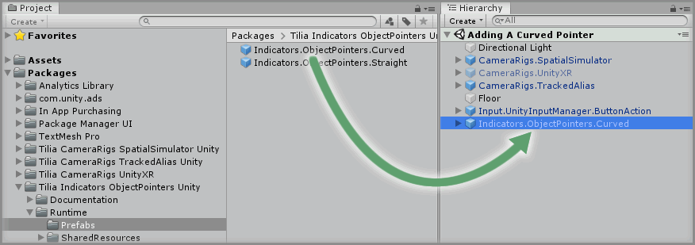
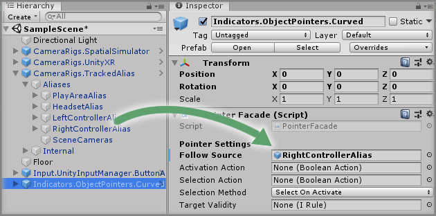
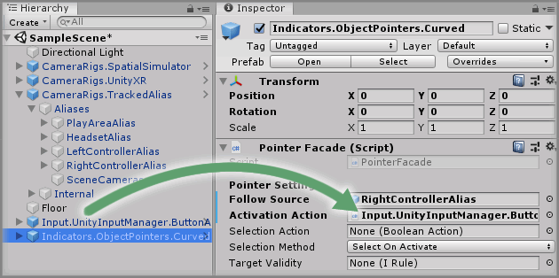
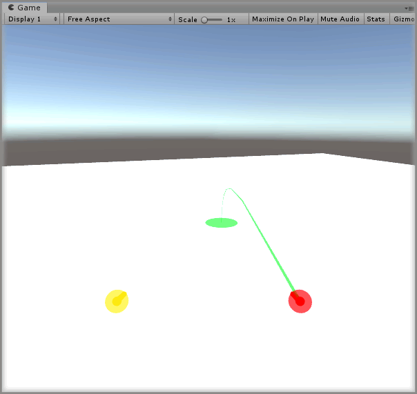

# Adding A Curved Pointer

> * Level: Beginner
>
> * Reading Time: 5 minutes
>
> * Checked with: Unity 2018.3.14f1

## Introduction

The Curved Pointer (also known as a Bezier or Parabolic Pointer) casts a curved line from an origin point forward a certain distance and then down until it collides with a collider. The representation of this forward and then downward cast is represented with a bezier curve, which basically plots a curved line between the origin of the beam and the final target point.

When a Curved Pointer is colliding with a valid GameObject, a Selection Action can occur which emits an event containing data about the GameObject that the Curved Pointer is currently colliding with.

The Curved Pointer is a popular choice when creating a teleport locomotion feature as the curved beam always lands on the floor making it easier to choose a destination location.

## Prerequisites

* [Add the Tilia.CameraRigs.TrackedAlias.Unity] prefab to the scene Hierarchy.
* [Add the Tilia.Input.UnityInputManager.ButtonAction] prefab to the scene Hierarchy.
* [Install the Tilia.Indicators.ObjectPointers.Unity] package dependency in to your [Unity] project.

## Let's Start

### Step 1

Expand the `Tilia Indicators ObjectPointers Unity` Package directory in the Unity Project window and select then `Packages -> Tilia Indicators ObjectPointers Unity -> Runtime -> Prefabs` directory then drag and drop the `Indicators.ObjectPointers.Curved` prefab into the Hierarchy window.

### Step 2

Select the `Indicators.ObjectPointers.Curved` prefab in the Unity Hierarchy and change the `Pointer Facade` component to configure the base functionality of the Pointer.

The `Follow Source` parameter determines what GameObject the Pointer should track in the scene, for example, if we want the Pointer to follow around the Right Controller GameObject then drag and drop the `CameraRigs.TrackedAlias -> Aliases -> RightControllerAlias` GameObject into the `Follow Source` parameter on the `Pointer Facade` component.

### Step 3

The Curved Pointer will be deactivated by default so we need a way of activating and deactivating the Pointer beam. This is done by hooking up a `BooleanAction`, when it emits `true` it will activate the Pointer and when it emits `false` it will deactivate the Pointer.

Any `BooleanAction` can be used to perform the activation/deactivation of the Pointer but in this instance we’re going to use the `Input.UnityInputManager.ButtonAction` that is already in the scene. The existing `BooleanAction` will emit `true` when the `Space` key is pressed and will emit `false` when the `Space` key is released.

Drag and drop the `Input.UnityInputManager.ButtonAction` GameObject into the `Activation Action` parameter on the `Pointer Facade` component.

### Done

We won’t use any of the other `Pointer Facade` parameters for now as we have all we need for a Curved Pointer to be activated when the `Space` key is pressed and it will point in a curved line in whatever direction the Right Controller is pointing.

Play the Unity scene and press the `Space` key and the Curved Pointer will emit a beam from the controller pointing in the forward direction of the controller. Notice how the Curved Pointer beam has two states when it is activated:

* Valid Collision - The Curved Pointer is colliding with a valid GameObject and displays as a green line.
* Invalid/No Collision - The Curved Pointer is not colliding with any valid GameObject and displays as a red line.

[Add the Tilia.CameraRigs.TrackedAlias.Unity]: https://github.com/ExtendRealityLtd/Tilia.CameraRigs.TrackedAlias.Unity/blob/master/Documentation/HowToGuides/AddingATrackedAlias/README.md
[Add the Tilia.Input.UnityInputManager.ButtonAction]: https://github.com/ExtendRealityLtd/Tilia.Input.UnityInputManager/blob/master/Documentation/HowToGuides/UsingTheUnityButtonAction/README.md
[Install the Tilia.Indicators.ObjectPointers.Unity]: ../Installation/README.md
[Unity]: https://unity3d.com/
