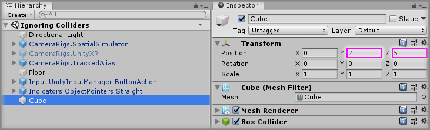
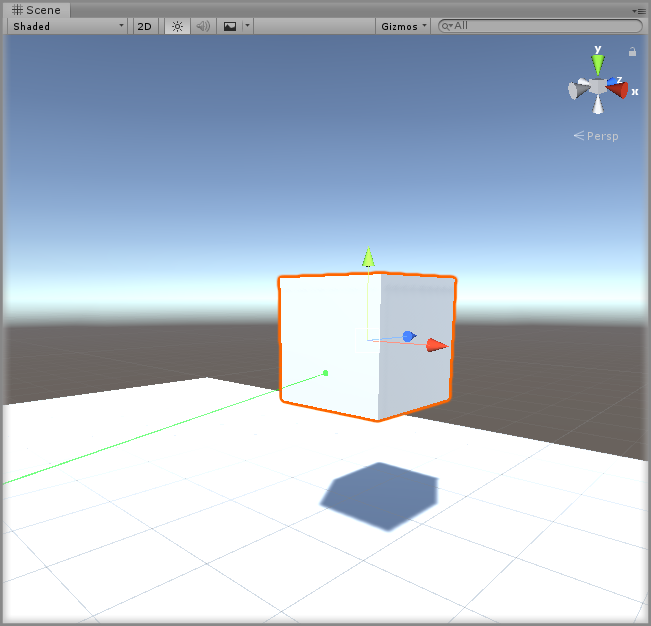
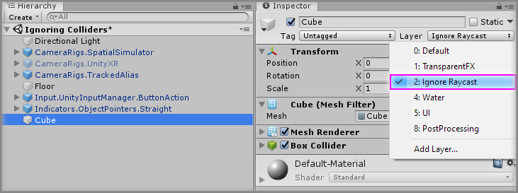
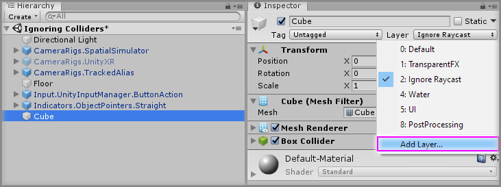
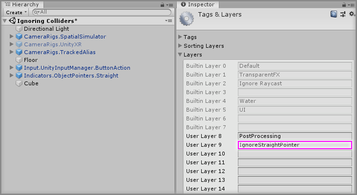
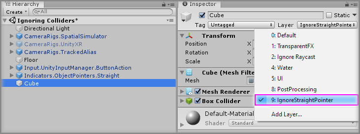
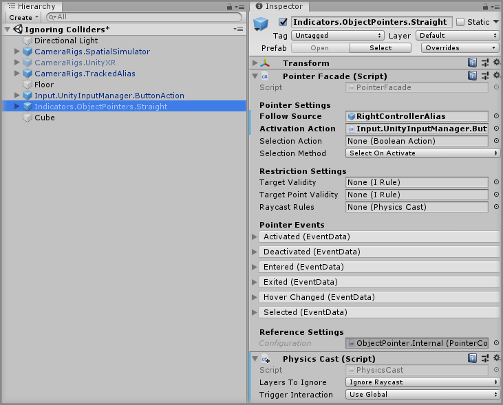
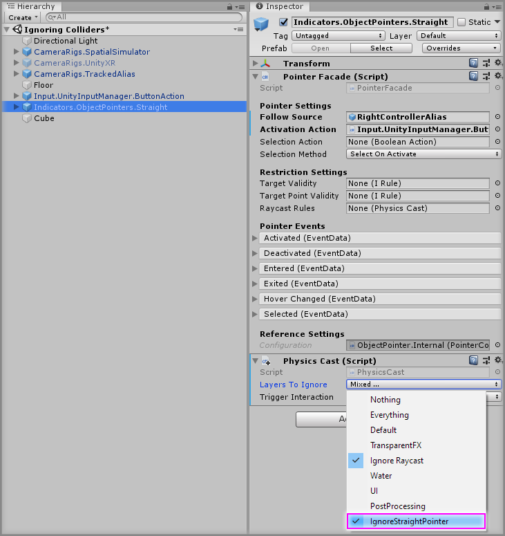
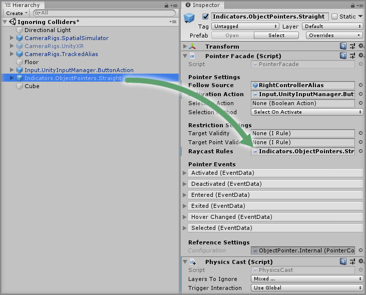

# Ignoring Colliders

> * Level: Beginner
>
> * Reading Time: 5 minutes
>
> * Checked with: Unity 2018.3.14f1

## Introduction

The Object Pointers will collide with any GameObject that contains a Collider (even a Trigger Collider), but there are times when we want our Object Pointers to completely ignore a GameObject as if it wasn't in the scene.

For example, if we are holding an Interactable Object in our hand, then we don't want our teleport pointer to collide with that Interactable Object and it would be better if the Object Pointer beam just passed straight through.

We can achieve this by customizing the RayCast of the Object Pointer to determine which GameObject Colliders the RayCast will consider as valid targets.

## Prerequisites

* [Add the Tilia.Tilia.Indicators.ObjectPointers.Unity -> Indicators.ObjectPointers.Straight] prefab to the scene hierarchy.

## Let's Start

### Step 1

Create a new `Cube` Unity 3D Object by selecting `Main Menu -> GameObject -> 3D Object -> Cube` and change the Transform properties to:

* Position: `X = 0, Y = 2, Z = 5`

### Step 2

Play the Unity scene, activate the Object Pointer by pressing the `Space` key and aim it at the `Cube`. You will see that the pointer beam hits the `Cube` as expected.

### Step 3

We can get our Straight Pointer RayCast to Ignore our `Cube` by simply putting the `Cube` on the `Ignore Raycast` layer.

Select the `Cube` GameObject from the Unity Hierarchy window and change the `Layer` property to `Ignore Raycast`.

### Step 4

Play the Unity scene, activate the Object Pointer by pressing the `Space` key and aim it at the `Cube`. You will see that the pointer beam now goes through our `Cube` as if it wasn't there. This is because the `Ignore Raycast` layer will be ignored by all RayCasts (unless told otherwise).

### Step 5

We could stop here, we've achieved what we set out to do, but what if we want our `Cube` to be picked up by other RayCasts in our scene? We've just told the `Cube` to be ignored by all RayCasts by putting it on the `Ignore Raycast` layer.

What if we just wanted our Straight Pointer to ignore the `Cube`? Well we can achieve that by using our own custom layer.

Create a new Layer by selecting the `Layer` property and selecting `Add Layer`.

Create a new layer called `IgnoreStraightPointer` by entering that text into a `User Layer` option.

Select the `Cube` GameObject from the Unity Hierarchy window and change the `Layer` property to `IgnoreStraightPointer`.

### Step 6

Now we have a custom Layer set up, we need to tell our Straight Pointer to ignore this custom Layer. We can do this with a `PhysicsCast` component.

Select the `Indicators.ObjectPointers.Straight` GameObject from the Unity Hierarchy window and click the `Add Component` button, then select the `PhysicsCast` component.

This newly created `PhysicsCast` will allow us to customize the rules for the Straight Pointer RayCast.

> You don't need to put this `PhysicsCast` component on the `Indicators.ObjectPointers.Straight` GameObject, but it is just convenient to do so.

### Step 7

Select the `Indicators.ObjectPointers.Straight` GameObject from the Unity Hierarchy window and on the `Physics Cast` component change the `Layers To Ignore` property value to include our `IgnoreStraightPointer` layer.

> Notice how the `Layers To Ignore` property has both the `Ignore Raycast` layer and our `IgnoreStraightPointer` layer selected, this means that our new RayCast rule will ignore both of these layers.

### Step 8

Now all we need to do is tell our Straight Pointer to use our custom `PhysicsCast` rules when the pointer casts the beam.

Drag and drop the `Indicators.ObjectPointers.Straight` GameObject into the `Raycast Rules` property on the `Pointer Facade` component.

### Done

Play the Unity scene, activate the Object Pointer by pressing the `Space` key and aim it at the `Cube`. You will see that the pointer beam now goes through our `Cube` as if it wasn't there. This is because our custom `Physics Cast` rule is telling our Straight Pointer to ignore the `IgnoreStraightPointer` layer.

[Add the Tilia.Tilia.Indicators.ObjectPointers.Unity -> Indicators.ObjectPointers.Straight]: ../AddingAStraightPointer/README.md