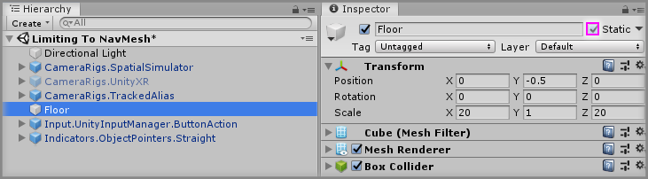
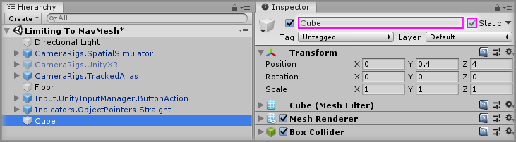
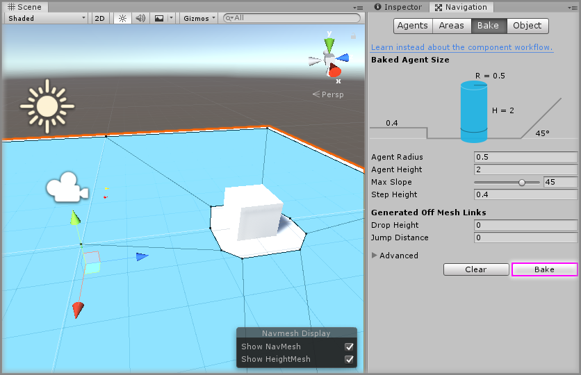
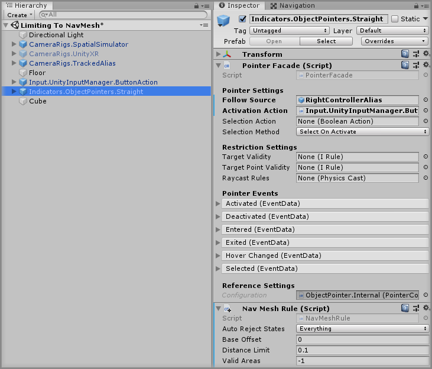
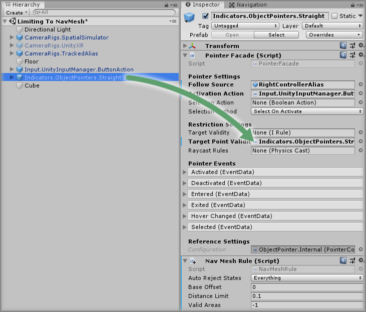
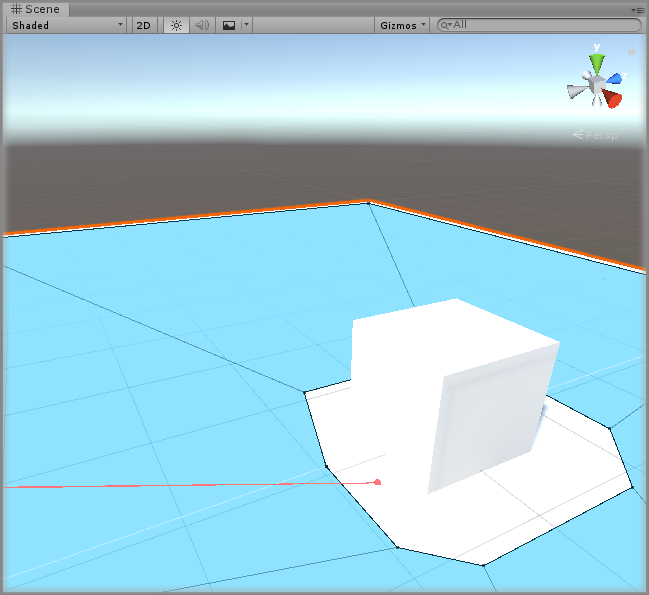

# Limiting To NavMesh

> * Level: Beginner
>
> * Reading Time: 5 minutes
>
> * Checked with: Unity 2018.3.14f1

## Introduction

We may want to use the [Unity NavMesh] to determine what areas of our scene are considered valid as this is a quick and effective way of mapping out a valid area within our scene.

We can achieve this by using a [Zinnia] rule.

## Prerequisites

* [Add the Tilia.Tilia.Indicators.ObjectPointers.Unity -> Indicators.ObjectPointers.Straight] prefab to the scene hierarchy.

## Let's Start

### Step 1

We'll first need some static scenery to be able to bake a Unity NavMesh, so let's start by setting our `Floor` GameObject to be a `Static` GameObject.

Select the `Floor` GameObject in the Unity Hierarchy window and tick the `Static` option.

### Step 2

Create a new `Cube` Unity 3D Object by selecting `Main Menu -> GameObject -> 3D Object -> Cube` and change the Transform properties to:

* Position: `X = 0, Y = 0.4, Z = 4`

Set the `Cube` GameObject to `Static`.

### Step 3

Now we need to bake a Unity NavMesh into our scene, so open the Navigation window by selecting `Main Menu -> Window -> AI -> Navigation`. Then in the `Bake` section, click on the `Bake` button to begin baking the Unity NavMesh.

### Step 4

Now we have our Unity NavMesh baked, we can set up our rule to tell our pointer to only consider the Unity NavMesh area as a valid target.

Select the `Indicators.ObjectPointers.Straight` GameObject from the Unity Hierarchy window and click the `Add Component` button, then select the `NavMeshRule` component.

This newly created `NavMeshRule` tells our pointer to only consider points on the Unity NavMesh as valid areas.

> You don't need to put this `NavMeshRule` component on the `Indicators.ObjectPointers.Straight` GameObject, but it is just convenient to do so.

### Step 5

Now all we need to do is tell our Straight Pointer to use our custom `NavMeshRule` rule.

Drag and drop the `Indicators.ObjectPointers.Straight` GameObject into the `Target Point Validity` property on the `Pointer Facade` component.

> This will take the `NavMeshRule` component that is found on the GameObject to populate the `Target Point Validity` property.

### Done

Play the Unity scene, activate the Object Pointer by pressing the `Space` key and aim it at the `Floor`. You will see that the pointer beam shows in the valid (green) state when it hits any part of the Unity NavMesh but shows in the invalid (red) state when it hits outside the Unity NavMesh.

[Unity NavMesh]: https://docs.unity3d.com/ScriptReference/AI.NavMesh.html
[Zinnia]: https://github.com/ExtendRealityLtd/Zinnia.Unity
[Add the Tilia.Tilia.Indicators.ObjectPointers.Unity -> Indicators.ObjectPointers.Straight]: ../AddingAStraightPointer/README.md