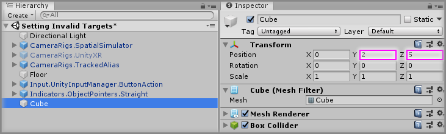
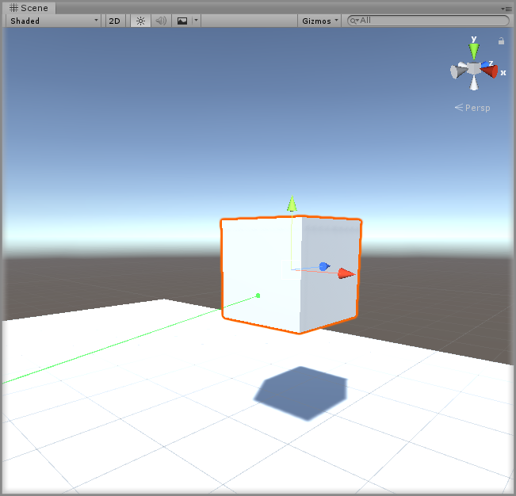
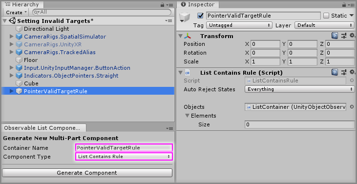
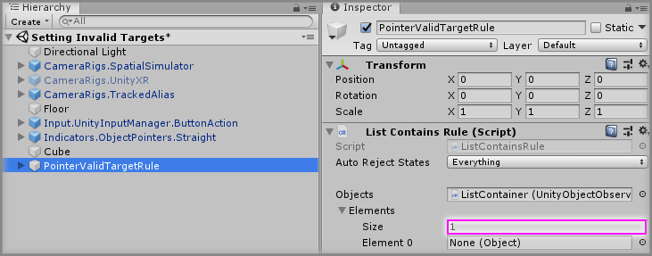
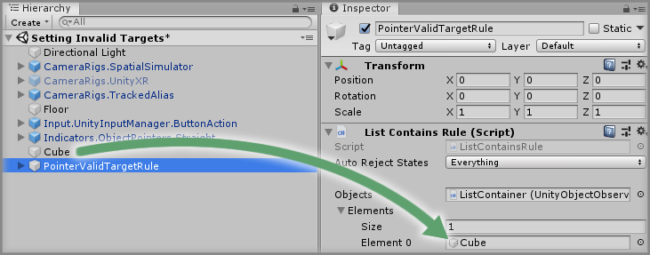
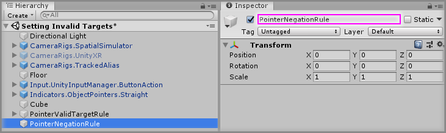
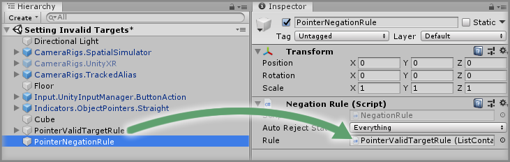
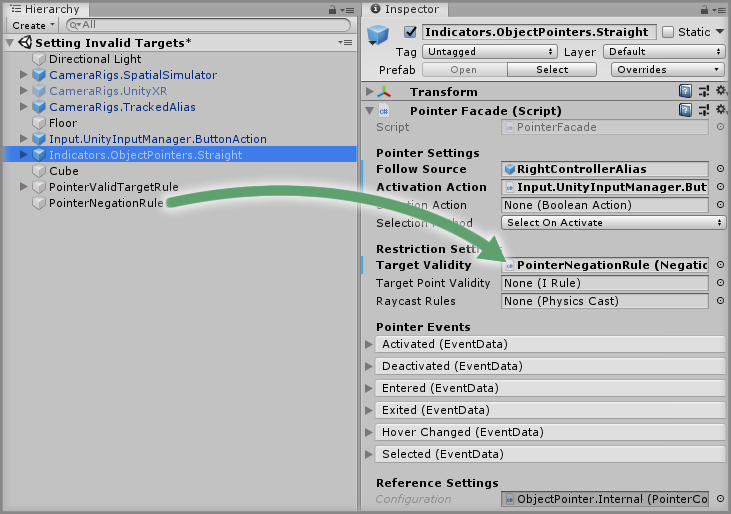
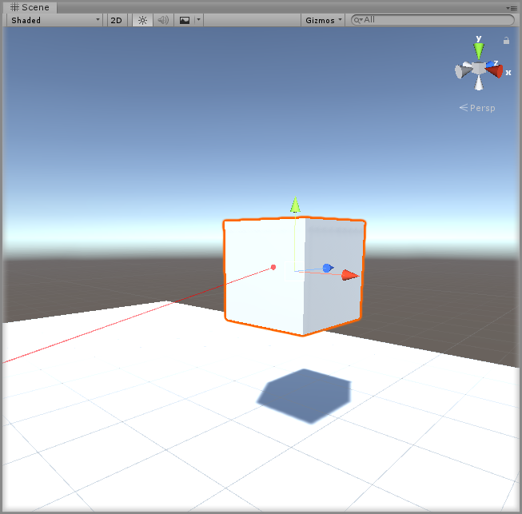

# Setting Invalid Targets

> * Level: Beginner
>
> * Reading Time: 5 minutes
>
> * Checked with: Unity 2018.3.14f1

## Introduction

The Object Pointers will consider any GameObject that contains a Collider as a valid target, which means the pointer will be in the valid state (by default this means the pointer displays as a green beam).

There are occasions where you want the Object Pointer to be able to collide with a GameObject but to consider the target invalid, such as an area you cannot teleport to or maybe a locked button.

We can achieve this by using the [Zinnia] rules to determine which targets are considered valid for out pointer.

## Prerequisites

* [Add the Tilia.Tilia.Indicators.ObjectPointers.Unity -> Indicators.ObjectPointers.Straight] prefab to the scene hierarchy.

## Let's Start

### Step 1

Create a new `Cube` Unity 3D Object by selecting `Main Menu -> GameObject -> 3D Object -> Cube` and change the Transform properties to:

* Position: `X = 0, Y = 2, Z = 5`

### Step 2

Play the Unity scene, activate the Object Pointer by pressing the `Space` key and aim it at the `Cube`. You will see that the pointer beam hits the `Cube`

### Step 3

We're going to set up a Zinnia Rule that states we want our Object Pointer to consider every GameObject valid except for the GameObjects we add to a list.

To do this, we're going to need two rules:

* The first rule is a `List Contains Rule` which allows us to say if something is in the list we specify then we consider it true.
* We then need a second rule called the `Negation Rule` as for our logic we actually want to say consider anything found in the list as the opposite of true, which is false.

This will give us the logic we need of `Consider any GameObject found in the List as an invalid GameObject`.

Let's start by setting up our `List Contains Rule` by selecting `Main Menu -> Window -> Zinnia -> Observable List Component Generator` window.

Set the `Container Name` property to `PointerValidTargetRule` and change the `Component Type` property to `List Contains Rule` then click the `Generate Component` button to create the GameObject containing our new `List Contains Rule` in the Unity Hierarchy window.

### Step 4

Select the `PointerValidTargetRule` GameObject from the Unity Hierarchy window then increase the `Objects -> Elements -> Size` property value by `1` on the `List Contains Rule` component.

> The size property will be `0` by default, so change it to `1`.

### Step 5

Drag and drop the `Cube` GameObject into the newly created `Element 0` property value within `Objects` property on the `List Contains Rule` component.

### Step 6

We've now set up our `List Contains Rule` to say anything included in our list will be considered as a valid target, but we actually want the opposite. This is where the `Negation Rule` comes in, so let's add a `Negation Rule` into our scene.

Create a new `Empty` GameObject by selecting `Main Menu -> GameObject -> Create Empty` and rename it to `PointerNegationRule`.

### Step 7

Select the `PointerNegationRule` GameObject from the Unity Hierarchy window and click the `Add Component` button, then select the `Negation Rule` component. Drag and drop the `PointerValidTargetRule` GameObject into the `Rule` property on the newly added `Negation Rule` component.

This newly created `Negation Rule` be used to flip the outcome of our `List Contains Rule`, so if our list contains our target then we want it to report `false` instead of `true`.

### Step 8

Drag and drop the `PointerNegationRule` GameObject into the `Target Validity` property on the `Pointer Facade` component within the `Indicators.ObjectPointers.Straight` GameObject.

### Done

Play the Unity scene, activate the Object Pointer by pressing the `Space` key and aim it at the `Cube`. You will see that the pointer beam still hits the `Cube` but it is showing red as it is in the invalid target state.

[Zinnia]: https://github.com/ExtendRealityLtd/Zinnia.Unity
[Add the Tilia.Tilia.Indicators.ObjectPointers.Unity -> Indicators.ObjectPointers.Straight]: ../AddingAStraightPointer/README.md